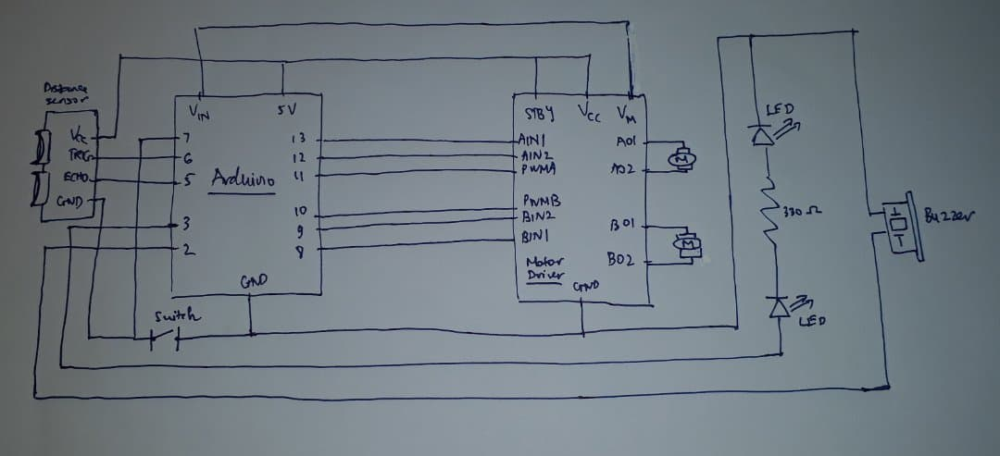

# Introduction:

This is the refined version of the final project proposal which includes a schematic and the functionality of Arduino and Processing

## Schematic

## Arduino

What it does:

* Controlling motors (to move in 4 directions), 2 blinking LEDS (blinking starts when an object is encountered) and a buzzer(playing 
an alarm sound when an object is encountered)

What it receives from Processing:

* 4 strings "F", "B", "R", "L" that give commands to the robot so that it moves in 4 directions
* For example, if Arduino reads "F", it will move the robot forwards through specific instructions to the 2 motors and the same 
for the other 3 commands

What it writes to Processing:

* 4 integers 0,1,2,3 that represent 4 states of the robots: powered off, powered on, encountering obstacles and not encountering 
any object, respectively

## Processing

What it does:

* Demonstrates a control interface for the robot in real time: there are 4 arrows and one of them will turn red when the user
presses an arrow on the keyboard and at the same time the 2D model of the vehicle in the interface will also move in the
corresponding direction, there are also three signalling boxes that tells the state of the robot: powered on, off and 
whether it encounters objects

What it receives from Arduino:

* 4 integers 0,1,2,3 that tell Processing what to demonstrate in the interface corresponding to the state of the robot
* For example, if Processing reads 0, the interface will show an off signal and it will not receive any instruction from the key board;
if Processing reads 2 (this means the robot is powered on and it also encounters obstacles), the on signal will turn on and 
the obstacle signalling box will blink

What it writes to Arduino:

* 4 strings "F","B","R","L" that dictate which direction the robot should move
