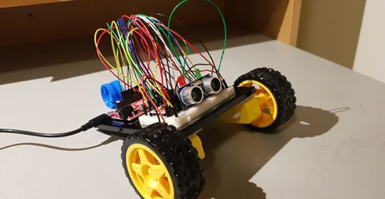

## Introduction

Since I have always been fond of WALLE (who is a famous movie character), I decided that I will try to recreate this character using the knowledge I have gained
in this class. The robot will have a control interface in which users can control the robot and see the changes in the state of the robot in real time. The robot 
itself can move forward, backward and rotate left and right. When it encounters and object, an alarm will be played and 2 LEDS will blink. The features that
I find the most realistic about the robot compared to WALLE are that it has two wheels and when I turn the robot on it will say "WALLLLLEEE" (which is so cute:( )
and that the robot can practically "dance" (through wide degree rotation) like a real WALLE.

You can click on the following !(link)[] to see a demo of the project.

## Processing program and its functionality

### What it does

* Demonstrates a control interface for the robot in real time: there are 4 arrows and one of them will turn red when the user
presses an arrow on the keyboard and at the same time the 2D model of the vehicle in the interface will also move in the
corresponding direction, there are also three signalling boxes that tells the state of the robot: powered on, off and 
whether it encounters objects

### What it receives from Arduino

* 4 integers 0,1,2,3 that tell Processing what to demonstrate in the interface corresponding to the state of the robot
* For example, if Processing reads 0, the interface will show an off signal and it will not receive any instruction from the key board;
if Processing reads 2 (this means the robot is powered on and it also encounters obstacles), the on signal will turn on and 
the obstacle signalling box will blink

### What it writes to Arduino

* 4 strings "F","B","R","L" that dictate which direction the robot should move

### A snapshot of the control interface

## Arduino and its functionality

### What it does

* Controlling motors (to move in 4 directions), 2 blinking LEDS (blinking starts when an object is encountered) and a buzzer(playing 
an alarm sound when an object is encountered)

### What it receives from Processing

* 4 strings "F", "B", "R", "L" that give commands to the robot so that it moves in 4 directions
* For example, if Arduino reads "F", it will move the robot forwards through specific instructions to the 2 motors and the same for the other 3 commands

### What it writes to Processing

* 4 integers 0,1,2,3 that represent 4 states of the robots: powered off, powered on, encountering obstacles and not encountering 
any object, respectively

### A snapshot of the robot

## Challenges and reflections

The whole process was a joy to me. I have always been interested in building a robot since I was a kid and being able to build one and even model if after my 
favorite movie character really satisfied me. I first started out by sketching the control interface and then I had to figure out the communication protocol 
between Processing and Arduino. The communicatino protocol to me was the most challenge part but at the same time it is what I am the most proud of in this project
: I design 2 different formats for the input from Processing and Arduino in order to make the communication more efficient (specifically, Processing only has to read inputs from Arduino and vice versa without having to read its own inputs from the Serial port). The second stage was to code the control interface program in which I found myself getting better at practicing OOP and state machine. The last stage was to code the Arduino program. Since I had references from other programs which demonstrates how to control motors and uses a distance sensor, I did not really had much difficulty during this process. The final part was to wire the circuit and it was a challenge which took me a great deal of time with lots of trials and errors to figure out the correct way to wire all the parts together.

