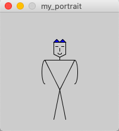

Here is my first assignment (drawing my portrait using Processing)

Remarks:
During the process, I got a chance to use different functions to draw shapes and other drawing functions such as triangle(), ellipse(), line(), fill() and noFill(). I also learned how to upload an image in a md file.
