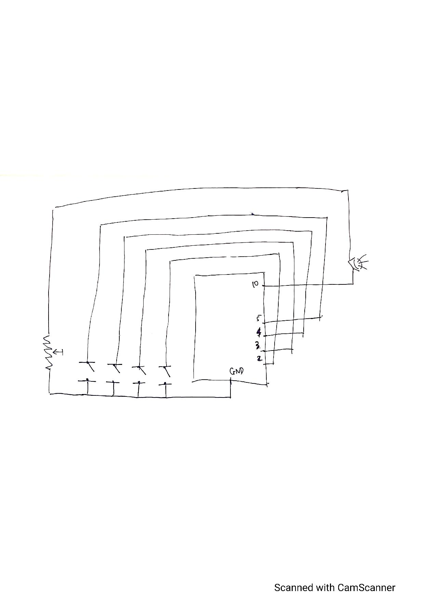
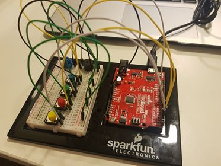

## Intro

In this project, I attempt to create a simple model of an electric key boards where users can play 7 notes A,B,C,D,E,F,G through 
7 combinations of 4 available notes on the breadboard. There is also a potentiometer to change the volume of the sound. The four buttons
and the potentiometer act as inputs to the arduino board while the loudspeaker acs as output from the arduino board.

## Display of my project

My schematic:

A demo:

[Link](https://drive.google.com/file/d/18kDQmSOEX2TT4ISixfs-TLgnCw1s0vjX/view?usp=sharing)

A photograph of my circuit:

## Reflection and Challenges

Through the process, I learned how to use the pwm digital pins as INPUT_PULLUP to read signals from the the buttons. I also learnd
how to properly connect the loudspeaker and the potentiometer (to make the potentiometer as a variable resitor changing the voltage in the loudspeaker
and change the volume as a result). To get everything working properly after a lot of trials is a challenge and fortunately I managed to finish it.

