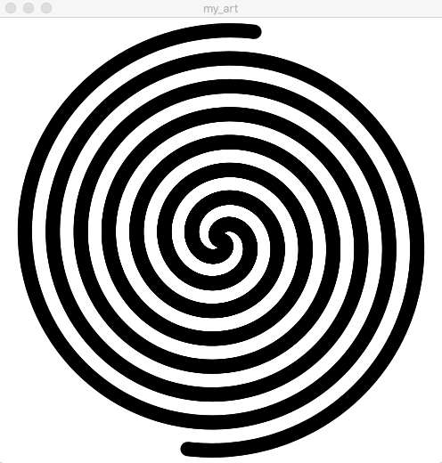

The video that shows the creation of double Archimedian spiral can be found in June2 Folder since I believe that md does not support an mov file. Hence I include a screen shot of it.

## Challenges

The most difficult part of this project is to use implement the equation of a spiral in my code and I managed to do it after looking up the spiral equation on the internet and I figured out that I had to use Cartesian coordinate instead of polar coordinate.

## Reflections
During the process, I had a chance to practice creating animating objects by incrementing its x and y coordinates in the draw() function.
I also used if and else if conditional statement along with the idea of state machine to make a looped animation.

