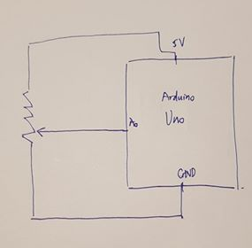
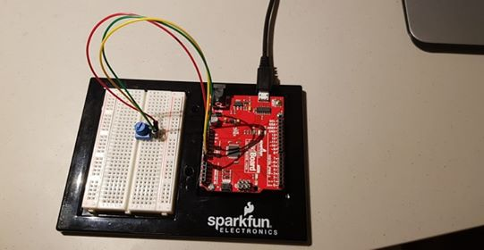

## Introduction

This project is the result of my attempt to utilize the communication between Arduino and Processing in order to create an 
interestingly interactive way of playing a simple game. I modified a game I created before in which the player uses the left and 
right arrows to control the bar in order to prevent the ball from falling past the screen and to score points. In this version,
the controlling method is to use the knob of the potentiometer located on my Red Board. In terms of the communication between
Processing and Arduino, my Arduino program writes the reading from the pin connecting to the potentiometer to the Serial port
and my Processing program reads it off from the port. The Processing program then converts the reading to the appropriate range 
of the x-position of the bar ( converting from range 0-1023 to range 0-(WIDTH-B_WIDTH) ). 

## Schematic and some snapshots of my project

The schematic:

A photograph:

A gif:

## Challenges and Reflections

The only challenge I encounter in this project was to set the x-position of the bar relatively to the number read from the potentiometer.
In the beginning, the x-position of the bar stayed at 0 although I have assigned the input from Arduino to the x-position of the bar
in the constructor of the Bar object. Howerver, I later realized that the change in the input variable is not reflected on the 
x-position of the Bar object automatically and hence my solution was to write an updating function and put it in the draw() function 
so that every time the reading change the x-position of the bar also changes.

