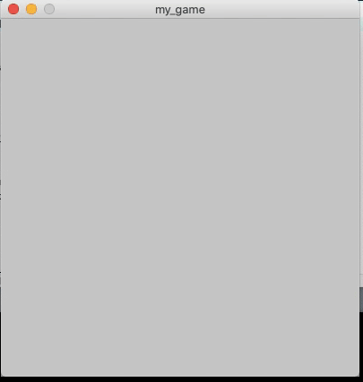

This is a simple game adapted from the code for a bouncing ball in class. The idea of the game is simple: when the ball hits the bar at the bottom it will bound off and each time the score increases by 1. The game ends when the player fails to hit the ball with the bar and the ball goes passed the bottom boundary of the screen.

## Remarks:
I added a new class called Bar() and member functions such as drawBar() and moveleft() and moveright(). The later two functions are called when the user presses left and right arrow button respectively.
I also added several conditional statements to check whether the ball hits the bar. When the ball hits the bar, it moves in a random direction.
In order to determine if the game has ended, I applied the concept of state machine (through the declaration of a new boolean variable lose: lose = false at the beginning and lose = true if the ball goes past the bottom boundary of the sreen).
I also managed to add texts to the game.

I also learned that md file does not support mov but it does support gif instead.

##Challenges
Although I have done object-oriented programming in Python and C++, I still needed to get used to the syntax in java. It was an enjoyable learning experience overall however.
