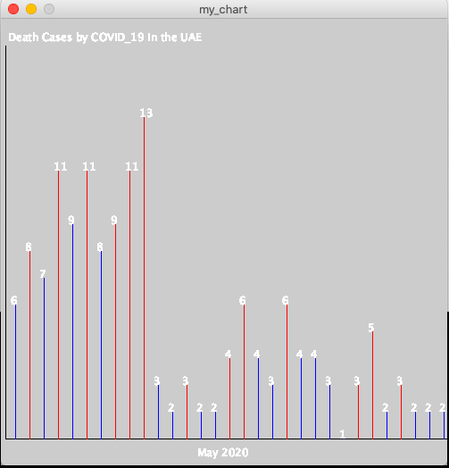
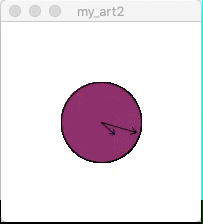

## I,
My data visualization assignment demonstrates the number of death cases by coronavirus in the UAE in May 2020.
In my chart, the data is visualized using vertical lines whose heights correspond to the daily corona virus cases.
Red lines signify that the number of cases increase compared to the previous day.
Blue lines signify that the number of cases stay the same or decreases compared to the previous day.

Following is a snapshot of my chart.

## II,
In my art work assignment, I tried to create a clock model with its minute hands and hour hands running at the speed of 12 to 1 ratio.
I also tried to gradually change the color of the clock to match the time of the day, although I only partially succeeded.

Following is a snapshot of my art.

## Reflections
In the data visualization assigment, I had a chance to practice reading from a file and output thte data in the form of a chart. 
I managed to modify the code given in class

In the art work assignment, I learned how to use and managed to understand pushMatrix() and popMatrix()

## Challenges
The challenge in my art work assignment was that I could not figure out how to combine the basic colors to make the color I want.
