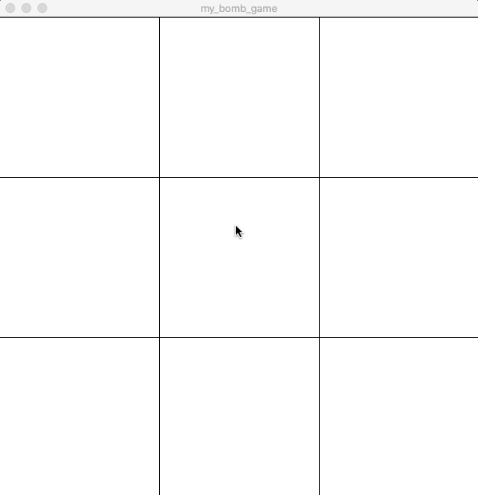

In this assignment, I attempted to model after a simple but fun computer game in which in order to win the player has to uncover all the tile except for the one that covers a bomb.
I first have to create a class Tile and put them in a 2D array and later on draw each them on the screen. Then I have to check which tile the mouse clicks on in order to uncover the tile. 
I also have to check when the player clicks on the tile with the bomb then the game ends.

This is a snapshot of my game.

## Reflection and Challenge

This task would have been a challenge for me since I have to complete coding a game in only an evening using Java which I am not used to.
I had to spend quite a lot of time to debug syntactically and logically. I still apply the concept of state machine in order to control the game flow.
It was a rewarding experience overall.

