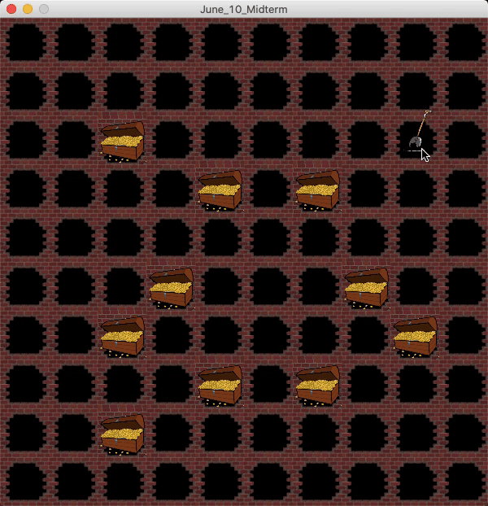

Overall concept
Instructions for usage
Describle problems/challenges

# Midterm project: Gold Mining

## I, Overall concept and Instructions for usage
My game is modeled after Minesweeper but with some modification: the objective to find, or "dig up" all the gold underground.
However, if along the process the player encounters a bomb that is positioned randomly on the board then the bomb explodes and the player loses.
At the beginning, to give some implication that the player must click on the mining box to play the game, I attached a small shovel to the cursor
and when clicking the mining box users might have a feel for "digging up" the gold. To enhance the experience further, I even included
the sound of shovel clinging when digging up hard rocks which precedes an image of a treasure of gold and the sound of bomb exploding which precedes 
the moment the player encounters the bomb.  

## II, Demo of the game
Following is a snapshot of my game and the board is of size 10x10 (100 mining boxes). As you can see, each time the player clicks on a mining box, either a gold treasure or a bomb appears. 
Remember that the obejective is to "dig up" all the gold without encountering the bomb. The bigger the board, the higher the number of available mining boxes.
Note that the size of the board can also be changed by changing the value of global variables board_h, board_w and tile_size.

## Challenges
The first challenge when I started coding the game is to figure out how to change the image of a mining box to the image of a gold treasure 
as well as how to move between different states of the game. After a bit of time doing trials and errors, I figured out that by 
assigning the state of the object to a boolean variable, I can better control the flow of the game. For example, I assign
a default value 'true' for attribute 'show' of the tile which signifies that defaultly the tile must be shown. When the player clicks 
on the tile, I change the value of 'show' to 'false' and hence in the next iteration the draw() function will not draw the mining box 
but instead the gold treasure (if you still find it unclear somehow, you can read my documented code in the attached .pde file).

My second challenge was to figure out how to use appropriate designs for the game. It took me time to find a suitable audio file
and then modify it in order to convey the most appropriate experience to users (for example, the digging sound can only about approximately
1 second long and being able to obtain the modified file to my satisfaction was really a success).Since I do not use instruction to explain the game
in the beginning, I need to make it as intuitive as possible. One way I went about achieving this effect is to attach a shovel 
to the cursor so that when users click the mining box combining with the shovelling sound they can have a feel for 'digging up' something. 
Also, the delay between the mouse click and the display of the image (the shovelling sound is played in between) 
and the darkness of the center of the mining box serve to convey an ambient feeling and help to build suspense of whether the player
will dig up the bomb and loses.

The additional challenge comes with the pressure of completing a whole game using Java which is a language I am still learning.
I had to get used to declaring arrays and variables in a way that is different from C++ and Python that I have learned before.
It also took time for me to get used to how the setup() and draw() function actually work in different scenarios.
